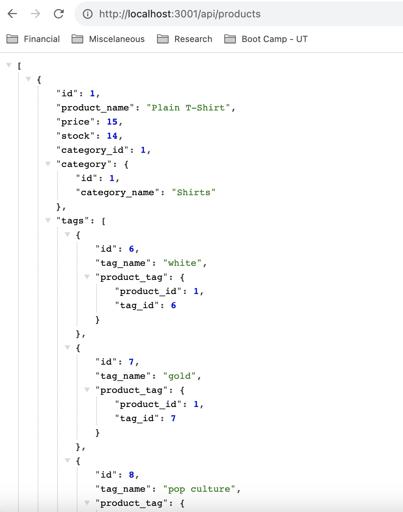
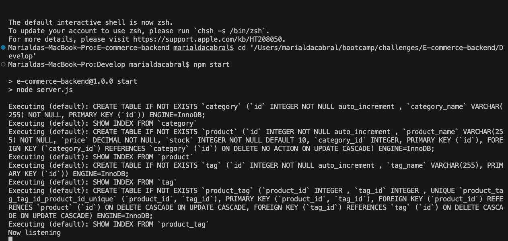

# E-commerce-BackEnd

## Table of Contents
  - [Description](#description)
  - [Screenshot](#screenshot)
  - [Installation](#installation)
  - [Usage](#usage)
  - [Video](#video)
  - [Contact](#contact)
 
## Description
This application is the back end for an e-commerce site. It takes a working Express.js API and configures it to use Sequelize to interact with a MySQL database.

## Screenshot
 When the application is running, you can see the reults of each route on the browser    
     

When the application is running, this is what you see in the terminal    
     

## Installation 
1 - npm initialize  
2 - Install mysql2  
3 - install dotenv   
3 - install express   
3 - install sequelize   
4 - go to mysql2 and source db/schema.sql  
5 - on the terminal npm run seed  

## Usage
1 - npm start in the terminal  
2 - Go to Insomnia to test get, get id, post, put and delete for each the routes below:  
  - api/categories:
  - api/products
  - api/tags
  
## Video
First video showing get and get by Id    
https://www.loom.com/share/faac198cdb514be6b134a902484c8d6b?sid=3eea9873-904f-4cee-93b3-a323602aa590

Second video showing post, put and delete    
https://www.loom.com/share/1f8ecf9c5ec04e26843da687d559efd9?sid=501e4075-7606-43c9-a491-d317ef3c80c4

## Contact
You can contact me via email: marialda@bellsouth.net
